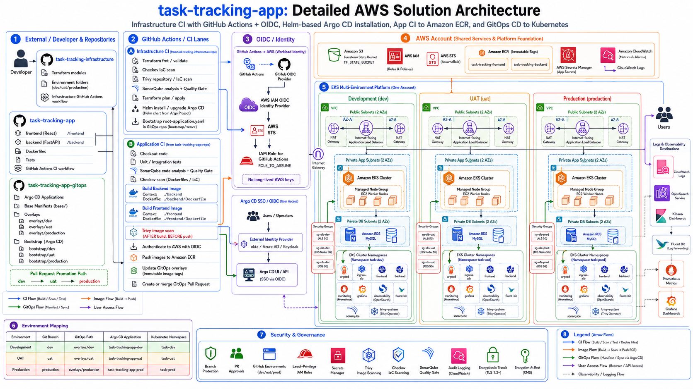
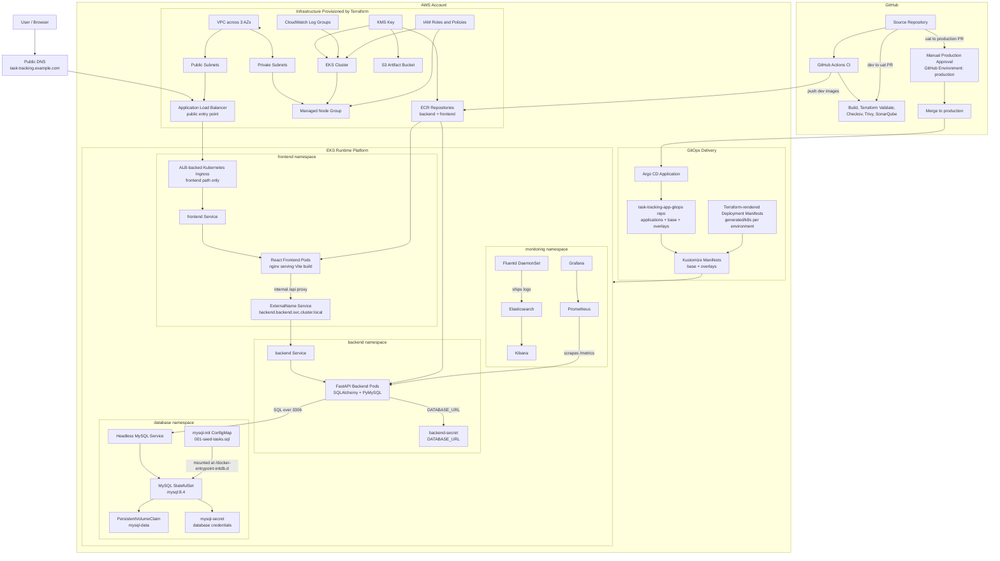
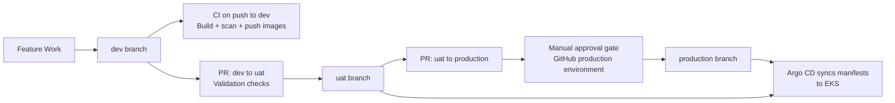
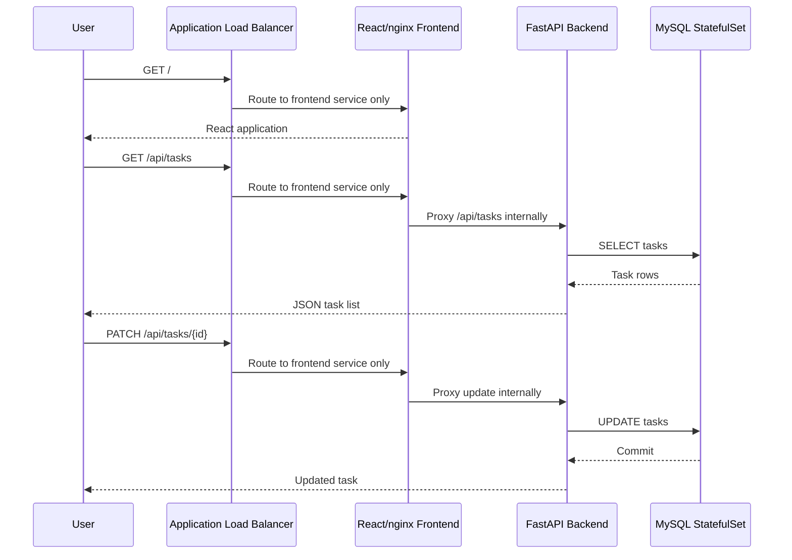
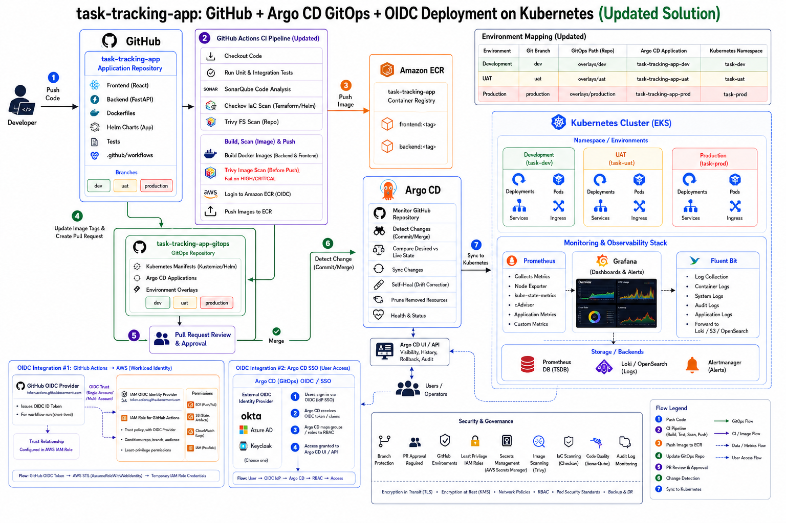
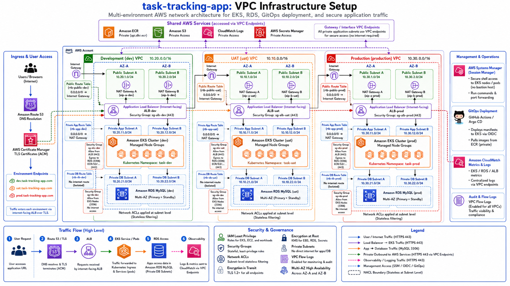

# Task Tracking Application Infrastructure

## Overview

This repository documents the infrastructure, security, continuous integration, GitOps continuous delivery, Kubernetes networking, and observability design for the **task-tracking-app**.

The solution separates responsibilities across three repositories:

| Repository | Primary responsibility |
|---|---|
| `task-tracking-infrastructure` | Provisions AWS infrastructure with Terraform and GitHub Actions |
| `task-tracking-app` | Builds, tests, scans, and publishes frontend/backend container images |
| `task-tracking-app-gitops` | Stores Kubernetes desired state and environment-specific deployment configuration |

The platform uses:

- GitHub Actions for infrastructure CI/CD and application CI.
- GitHub OIDC and AWS STS for short-lived AWS credentials.
- Terraform for AWS infrastructure provisioning.
- Amazon EKS for Kubernetes workloads.
- Helm for platform-component installation.
- Argo CD for GitOps continuous delivery.
- Amazon ECR for immutable container images.
- Amazon RDS for the application database.
- Prometheus and Grafana for metrics and dashboards.
- Fluent Bit, Elasticsearch/OpenSearch, and Kibana for centralized logging.
- SonarQube, Checkov, Trivy, and Trivy Operator for security and quality controls.


---

# Application Architecture

## AWS Architecture Diagram



## End-to-End Architecture



## Promotion Flow



## Runtime Request Flow



## Runtime

The task tracking app uses a React frontend, FastAPI backend, and MySQL database. Frontend and backend containers are stateless and can scale horizontally. MySQL runs as a local container for development and as a Kubernetes StatefulSet in the included manifests.

The frontend is served by nginx and calls the backend through `/api` routes. In Kubernetes, public traffic enters through an AWS Application Load Balancer and routes only to the frontend service. The frontend nginx container proxies `/api` requests to the internal backend service through the frontend namespace `ExternalName` service. The backend reads `DATABASE_URL` from `backend-secret` and connects to MySQL through the headless `mysql` service in the database namespace.

Fresh MySQL databases are initialized with `database/init/001-seed-tasks.sql` locally and with the `mysql-init` ConfigMap in Kubernetes. The script creates the `tasks` table if needed and inserts sample tasks for `todo`, `in_progress`, and `done`.

## Platform

Terraform provisions an AWS EKS cluster with networking across three availability zones and a managed node group with two desired worker nodes.

The Terraform environments (`dev`, `uat`, and `production`) provision the shared platform pattern with environment-specific names, CIDR ranges, ECR repositories, KMS encryption, CloudWatch log groups, and worker node settings. Kubernetes application manifests are owned by the separate GitOps repository and deployed by Argo CD.

Terraform installs the AWS Load Balancer Controller into EKS with Helm and an IRSA-backed service account. The Kubernetes ingress uses `ingressClassName: alb`, allowing the controller to create and manage the public Application Load Balancer that forwards traffic only to the frontend service.

## Delivery

GitHub Actions validates application builds, Terraform, Dockerfiles, Kubernetes manifests, and source quality. Argo CD continuously syncs the Kubernetes manifests from the repository.

The branch promotion model is:

- Pushes to `dev` run validation and publish backend/frontend images to ECR.
- Pull requests from `dev` to `uat` run UAT validation.
- Pull requests from `uat` to `production` pause at the `production` GitHub Environment approval gate.

## Security

Checkov scans Terraform, Kubernetes, Dockerfiles, and GitHub Actions. Trivy scans the repository filesystem and built images. SonarQube analysis runs when `SONAR_TOKEN` and `SONAR_HOST_URL` repository secrets are configured.

Kubernetes secrets hold database connection values and MySQL credentials. EKS uses KMS-backed encryption for configured cluster resources, and ECR repositories use KMS encryption with image scanning enabled.

## Observability

Prometheus scrapes annotated pods, Grafana visualizes metrics, and Fluentd ships Kubernetes logs to Elasticsearch for Kibana search and dashboards.

---

## Architecture diagrams

### 1. GitHub, CI, GitOps, OIDC, Argo CD, and Kubernetes



This view shows the application delivery path:

```text
Developer
   ↓
GitHub application repository
   ↓
GitHub Actions CI
   ├── Unit and integration tests
   ├── SonarQube analysis
   ├── Checkov scanning
   ├── Trivy repository scanning
   ├── Docker image build
   └── Trivy image scan
   ↓
Amazon ECR
   ↓
GitOps repository image-tag update
   ↓
Argo CD
   ↓
Amazon EKS
   ├── task-dev
   ├── task-uat
   └── task-prod
```

### 2. Detailed AWS solution architecture


This diagram presents the complete AWS solution, including:

- GitHub repositories and CI workflows.
- AWS IAM OIDC provider.
- AWS STS and IAM roles.
- Amazon S3 Terraform backend.
- Amazon ECR repositories.
- Amazon EKS clusters and managed node groups.
- Application Load Balancers.
- Amazon RDS databases.
- AWS Secrets Manager.
- Amazon CloudWatch.
- Centralized monitoring and logging.
- Argo CD and environment promotion.

### 3. VPC infrastructure architecture



This view focuses on network isolation, routing, and traffic flow for development, UAT, and production.

---

## Solution principles

| Principle | Implementation |
|---|---|
| Infrastructure as Code | Terraform modules and environment configurations |
| Immutable deployments | Images tagged with Git commit SHA |
| GitOps | Kubernetes desired state stored in Git |
| Least privilege | Separate GitHub OIDC roles and scoped IAM policies |
| Environment isolation | Separate VPCs, namespaces, state files, and environment approvals |
| No long-lived AWS keys | GitHub Actions assumes IAM roles through OIDC |
| Security before deployment | SonarQube, Checkov, and Trivy gates |
| Runtime security | Trivy Operator scans deployed Kubernetes resources |
| Centralized observability | Prometheus, Grafana, Fluent Bit, Elasticsearch/OpenSearch, and Kibana |
| Repeatable platform bootstrap | Helm installs Argo CD; root applications bootstrap platform components |

---

## Environment design

| Environment | Git branch | VPC CIDR | Kubernetes namespace | GitOps path | Argo CD application |
|---|---|---:|---|---|---|
| Development | `dev` | `10.20.0.0/16` | `task-dev` | `overlays/dev` | `task-tracking-app-dev` |
| UAT | `uat` | `10.10.0.0/16` | `task-uat` | `overlays/uat` | `task-tracking-app-uat` |
| Production | `production` | `10.30.0.0/16` | `task-prod` | `overlays/production` | `task-tracking-app-prod` |

### Promotion policy

```text
Push to dev
   ↓
Build, test, scan, and deploy to development

Pull request: dev → uat
   ↓
Validate promotion and run CI
   ↓
Merge
   ↓
Promote tested image tags to UAT

Pull request: uat → production
   ↓
Validate promotion and run CI
   ↓
Production approval
   ↓
Merge
   ↓
Promote tested UAT image tags to production
```

Direct pushes to `uat` and `production` should be blocked through branch protection.

---

## Repository architecture

### Infrastructure repository

```text
task-tracking-infrastructure/
├── .github/
│   └── workflows/
│       ├── infrastructure-ci.yml
│       └── bootstrap-state.yml
├── bootstrap/
│   ├── backend/
│   └── oidc/
├── modules/
│   ├── vpc/
│   ├── eks/
│   ├── ecr/
│   ├── rds/
│   ├── iam/
│   ├── kms/
│   ├── security-groups/
│   ├── vpc-endpoints/
│   ├── route53/
│   ├── acm/
│   └── observability/
├── environments/
│   ├── dev/
│   │   ├── main.tf
│   │   ├── variables.tf
│   │   ├── outputs.tf
│   │   ├── providers.tf
│   │   ├── backend.tf
│   │   └── dev.tfvars
│   ├── uat/
│   │   ├── main.tf
│   │   ├── variables.tf
│   │   ├── outputs.tf
│   │   ├── providers.tf
│   │   ├── backend.tf
│   │   └── uat.tfvars
│   └── production/
│       ├── main.tf
│       ├── variables.tf
│       ├── outputs.tf
│       ├── providers.tf
│       ├── backend.tf
│       └── production.tfvars
├── platform/
│   └── argocd/
│       └── values.yaml
├── sonar-project.properties
└── README.md
```

### Application repository

```text
task-tracking-app/
├── .github/
│   └── workflows/
│       └── ci.yml
├── frontend/
│   ├── Dockerfile
│   ├── package.json
│   └── src/
├── backend/
│   ├── Dockerfile
│   ├── requirements.txt
│   └── app/
├── database/
├── tests/
├── sonar-project.properties
└── README.md
```

### GitOps repository

```text
task-tracking-app-gitops/
├── bootstrap/
│   ├── dev/
│   │   └── root-application.yaml
│   ├── uat/
│   │   └── root-application.yaml
│   └── production/
│       └── root-application.yaml
├── applications/
│   ├── project.yaml
│   ├── task-tracking-app-dev.yaml
│   ├── task-tracking-app-uat.yaml
│   ├── task-tracking-app-production.yaml
│   ├── monitoring.yaml
│   ├── eck-operator.yaml
│   ├── elastic-stack.yaml
│   ├── fluent-bit.yaml
│   ├── sonarqube.yaml
│   └── trivy-operator.yaml
├── base/
│   ├── frontend-deployment.yaml
│   ├── frontend-service.yaml
│   ├── backend-deployment.yaml
│   ├── backend-service.yaml
│   └── kustomization.yaml
├── overlays/
│   ├── dev/
│   │   └── kustomization.yaml
│   ├── uat/
│   │   └── kustomization.yaml
│   └── production/
│       └── kustomization.yaml
├── observability/
│   ├── elastic-stack/
│   ├── fluent-bit/
│   └── monitoring/
├── platform/
│   ├── sonarqube/
│   └── trivy-operator/
└── README.md
```

---

## AWS infrastructure components

| AWS service | Purpose |
|---|---|
| Amazon VPC | Isolated networking for each environment |
| Public subnets | ALB and NAT Gateway placement |
| Private application subnets | EKS worker nodes and application workloads |
| Private database subnets | Amazon RDS deployment |
| Internet Gateway | Internet connectivity for public subnets |
| NAT Gateway | Controlled outbound internet access from private application subnets |
| Route tables | Public, application, and database traffic routing |
| Security groups | Stateful network access controls |
| Network ACLs | Stateless subnet-level filtering |
| VPC endpoints | Private access to AWS APIs and services |
| Amazon EKS | Managed Kubernetes control plane |
| EKS managed node groups | Kubernetes worker capacity |
| Amazon ECR | Frontend and backend image storage |
| Amazon RDS MySQL | Relational application database |
| Amazon S3 | Terraform remote state |
| AWS IAM | Roles, policies, and workload permissions |
| AWS STS | Temporary credentials for GitHub OIDC |
| AWS KMS | Encryption for state, database, storage, and secrets |
| AWS Secrets Manager | Application and platform secrets |
| Elastic Load Balancing | Internet-facing application entry point |
| Amazon Route 53 | DNS management |
| AWS Certificate Manager | TLS certificates |
| Amazon CloudWatch | Metrics, logs, alarms, and operational visibility |
| AWS Systems Manager | Secure administrative access |
| AWS CloudTrail | AWS API audit trail |

---

## VPC and subnet design

Each environment uses a separate VPC across at least two Availability Zones.

### Development

| Resource | AZ A | AZ B |
|---|---|---|
| Public subnet | `10.20.1.0/24` | `10.20.2.0/24` |
| Private application subnet | `10.20.11.0/24` | `10.20.12.0/24` |
| Private database subnet | `10.20.21.0/24` | `10.20.22.0/24` |

### UAT

| Resource | AZ A | AZ B |
|---|---|---|
| Public subnet | `10.10.1.0/24` | `10.10.2.0/24` |
| Private application subnet | `10.10.11.0/24` | `10.10.12.0/24` |
| Private database subnet | `10.10.21.0/24` | `10.10.22.0/24` |

### Production

| Resource | AZ A | AZ B |
|---|---|---|
| Public subnet | `10.30.1.0/24` | `10.30.2.0/24` |
| Private application subnet | `10.30.11.0/24` | `10.30.12.0/24` |
| Private database subnet | `10.30.21.0/24` | `10.30.22.0/24` |

### Routing

| Subnet type | Default route | Internet exposure |
|---|---|---|
| Public | Internet Gateway | Yes |
| Private application | NAT Gateway | Outbound only |
| Private database | No internet default route | No |

### Recommended VPC endpoints

| Endpoint | Type | Purpose |
|---|---|---|
| Amazon S3 | Gateway | Terraform artifacts, application objects, and private S3 access |
| Amazon ECR API | Interface | ECR control-plane operations |
| Amazon ECR Docker | Interface | Private image pulls |
| AWS STS | Interface | Temporary credentials |
| CloudWatch Logs | Interface | Private log delivery |
| Secrets Manager | Interface | Private secret retrieval |
| Systems Manager | Interface | Node administration |
| EC2 Messages | Interface | Systems Manager communication |
| SSM Messages | Interface | Session Manager channels |

---

## Network traffic flows

### User request flow

```text
User
  ↓ HTTPS 443
Route 53
  ↓
AWS Certificate Manager
  ↓
Internet-facing Application Load Balancer
  ↓
Kubernetes Ingress
  ↓
Frontend Service
  ↓
Frontend Pods
```

### Backend request flow

```text
Frontend
  ↓ HTTP/HTTPS inside the cluster
Backend Service
  ↓
Backend Pods
```

### Database flow

```text
Backend Pods
  ↓ TCP 3306
RDS security group
  ↓
Amazon RDS MySQL
```

### Image pull flow

```text
EKS worker node or Pod
  ↓
ECR API endpoint
  ↓
ECR Docker endpoint
  ↓
Amazon ECR image layers
```

### Administrative access

```text
Authorized operator
  ↓
AWS Systems Manager Session Manager
  ↓
EKS worker node or approved administration target
```

No inbound SSH port is required.

---

## Infrastructure CI/CD flow

```text
Infrastructure commit
   ↓
GitHub Actions
   ├── Terraform format
   ├── Terraform validate
   ├── Checkov scan
   ├── Trivy repository/IaC scan
   ├── SonarQube analysis
   └── Terraform plan
   ↓
GitHub Environment approval
   ↓
Terraform apply
   ↓
Create or update VPC, EKS, ECR, RDS, IAM, and supporting services
   ↓
Configure kubectl for EKS
   ↓
Install Helm
   ↓
Install or upgrade Argo CD
   ↓
Apply environment-specific root application
```

### Infrastructure promotion behavior

| Event | Action |
|---|---|
| Push to `dev` | Validate, plan, and apply development infrastructure |
| Open PR `dev → uat` | Validate and plan UAT |
| Merge PR `dev → uat` | Apply UAT infrastructure |
| Open PR `uat → production` | Validate and plan production |
| Merge PR `uat → production` | Approval and production apply |

---

## Application CI flow

```text
Application push to dev
   ↓
Checkout source
   ↓
Frontend and backend tests
   ↓
SonarQube quality gate
   ↓
Checkov repository/IaC scan
   ↓
Trivy filesystem scan
   ↓
Build frontend and backend Docker images
   ↓
Trivy image scan
   ↓
Fail on blocking HIGH/CRITICAL findings
   ↓
Authenticate to AWS through OIDC
   ↓
Push immutable images to ECR
   ↓
Update overlays/dev
   ↓
Argo CD deploys development
```

### Explicit Docker build contexts

| Component | Build context | Dockerfile |
|---|---|---|
| Frontend | `./frontend` | `./frontend/Dockerfile` |
| Backend | `./backend` | `./backend/Dockerfile` |

Trivy image scanning must occur **after image build and before ECR push**.

---

## GitOps CD flow

```text
GitOps repository
   ↓
Environment overlay changes
   ↓
Argo CD detects drift
   ↓
Argo CD renders Kustomize or Helm
   ↓
Compare desired state with live state
   ↓
Synchronize Kubernetes resources
   ↓
Run health checks
   ↓
Mark application Synced and Healthy
```

### Argo CD environment mapping

| Application | Source path | Destination namespace |
|---|---|---|
| `task-tracking-app-dev` | `overlays/dev` | `task-dev` |
| `task-tracking-app-uat` | `overlays/uat` | `task-uat` |
| `task-tracking-app-production` | `overlays/production` | `task-prod` |

Recommended automated policy:

```yaml
syncPolicy:
  automated:
    prune: true
    selfHeal: true
  syncOptions:
    - CreateNamespace=true
```

---

## Helm and Argo CD bootstrap

The infrastructure workflow installs Argo CD after Terraform creates the EKS cluster.

```text
Terraform apply
   ↓
terraform output -raw cluster_name
   ↓
aws eks update-kubeconfig
   ↓
helm repo add argo
   ↓
helm upgrade --install argocd
   ↓
kubectl apply environment root-application.yaml
```

Environment root paths:

| Environment | Root application |
|---|---|
| Development | `bootstrap/dev/root-application.yaml` |
| UAT | `bootstrap/uat/root-application.yaml` |
| Production | `bootstrap/production/root-application.yaml` |

The root application creates the environment application and cluster platform applications, including monitoring, logging, SonarQube, and Trivy Operator.

---

## Security scanning and quality controls

| Tool | Execution location | Purpose | Blocking gate |
|---|---|---|---|
| SonarQube | GitHub Actions and `sonarqube` namespace | Code quality, SAST, maintainability | Yes |
| Checkov | GitHub Actions | Terraform, Kubernetes, Dockerfile, and workflow policies | Yes |
| Trivy filesystem | GitHub Actions | Vulnerabilities, secrets, and misconfigurations | Yes |
| Trivy image | GitHub Actions after build | Container-image vulnerabilities | Yes |
| Trivy Operator | `trivy-system` namespace | Continuous Kubernetes runtime assessment | Operational |
| CloudWatch/CloudTrail | AWS account | Audit and operational monitoring | Alerting |

### Security report locations

| Report | Location |
|---|---|
| Checkov SARIF | GitHub Security tab and workflow artifacts |
| Trivy filesystem SARIF | GitHub Security tab and workflow artifacts |
| Trivy image SARIF | Workflow artifacts |
| SonarQube results | SonarQube dashboard |
| SonarQube scanner task report | Workflow artifact |
| Trivy Operator reports | Kubernetes custom resources |

Example runtime report commands:

```bash
kubectl get vulnerabilityreports -A
kubectl get configauditreports -A
kubectl get exposedsecretreports -A
kubectl get rbacassessmentreports -A
```

---

## OIDC and identity flows

### GitHub Actions to AWS

```text
GitHub Actions
   ↓ Requests OIDC token
GitHub OIDC provider
   ↓
AWS IAM OIDC identity provider
   ↓ AssumeRoleWithWebIdentity
AWS STS
   ↓
Temporary IAM role credentials
   ↓
Terraform, ECR, EKS, and approved AWS APIs
```

No permanent AWS access keys are stored in GitHub.

### Argo CD user authentication

```text
User
   ↓
OIDC identity provider
   ├── Okta
   ├── Microsoft Entra ID
   └── Keycloak
   ↓
Argo CD
   ↓
OIDC claims and groups
   ↓
Argo CD RBAC role
```

### Argo CD repository authentication

Argo CD repository access is separate from GitHub Actions OIDC. Use one of:

- GitHub App authentication.
- SSH deploy key.
- Fine-grained access token.

GitHub App authentication is preferred for production.

---

## IAM role model

| Role | Trusted identity | Primary permissions |
|---|---|---|
| Infrastructure CI role | GitHub OIDC | Terraform-managed AWS infrastructure |
| Application CI role | GitHub OIDC | ECR authentication and image push |
| EKS cluster role | EKS service | EKS control-plane operations |
| EKS node role | EC2 | Node registration, ECR pull, logging |
| Workload roles | EKS OIDC / pod identity | Application-specific AWS APIs |
| Argo CD role | Kubernetes service account or workload identity | Optional AWS integrations |

Roles should be scoped by repository, branch, environment, and audience in their trust policies.

---

## Security-group matrix

| Source | Destination | Port | Purpose |
|---|---|---:|---|
| Internet | ALB | 443 | Application HTTPS |
| ALB security group | EKS ingress targets | Application target port | Forward application traffic |
| EKS node/pod security group | RDS | 3306 | MySQL access |
| EKS workloads | VPC endpoints | 443 | Private AWS API access |
| EKS workloads | DNS resolver | 53 | DNS resolution |
| Administrators | Argo CD ALB/Ingress | 443 | Argo CD UI/API |
| Prometheus | Application metrics endpoints | Metrics port | Metrics scraping |

Avoid `0.0.0.0/0` on database, Kubernetes API, node, and internal service ports.

---

## Observability architecture

### Metrics

```text
EKS nodes and Pods
   ├── node-exporter
   ├── kube-state-metrics
   ├── cAdvisor
   └── application metrics
          ↓
Prometheus
          ↓
Grafana
          ↓
Dashboards and alerts
```

### Logs

```text
Pod stdout/stderr
   ↓
Fluent Bit DaemonSet
   ↓
Elasticsearch or OpenSearch
   ↓
Kibana
```

Kubernetes metadata should include:

- Namespace.
- Pod.
- Container.
- Node.
- Labels.
- Environment.

This allows filtering by `task-dev`, `task-uat`, and `task-prod`.

### AWS operational telemetry

- CloudWatch Logs for AWS and selected Kubernetes logs.
- CloudWatch metrics and alarms for EKS, RDS, ALB, and infrastructure.
- VPC Flow Logs for network auditing.
- CloudTrail for account-level API auditing.

---

## Terraform state design

| Environment | State key |
|---|---|
| Development | `task-tracking-app/dev/terraform.tfstate` |
| UAT | `task-tracking-app/uat/terraform.tfstate` |
| Production | `task-tracking-app/production/terraform.tfstate` |

Recommended backend features:

- S3 bucket versioning.
- Server-side encryption with KMS.
- Public access blocked.
- Native S3 lock file enabled.
- Bucket access logging or CloudTrail data events.
- Least-privilege backend IAM access.

---

## GitHub configuration

### Infrastructure repository variables

```text
AWS_ACCOUNT_ID
AWS_REGION
PROJECT_NAME
TERRAFORM_VERSION
TF_STATE_BUCKET
ROLE_TO_ASSUME

ARGOCD_NAMESPACE
ARGOCD_RELEASE_NAME
ARGOCD_CHART_VERSION
ARGOCD_VALUES_FILE

GITOPS_REPOSITORY
GITOPS_BRANCH
GITOPS_ROOT_APPLICATION_PATH
BOOTSTRAP_ARGOCD

SONAR_HOST_URL
SONAR_PROJECT_KEY
SONAR_PROJECT_NAME
```

### Infrastructure repository secrets

```text
SONAR_TOKEN
GITOPS_TOKEN
```

### Application repository variables

```text
AWS_ACCOUNT_ID
AWS_REGION
PROJECT_NAME
ROLE_TO_ASSUME
ECR_FRONTEND_REPOSITORY
ECR_BACKEND_REPOSITORY
GITOPS_REPOSITORY
GITOPS_BRANCH
SONAR_HOST_URL
```

### Application repository secrets

```text
SONAR_TOKEN
GITOPS_TOKEN
```

### GitHub environments

Create:

```text
dev
uat
production
```

Configure required reviewers for production.

---

## Deployment sequence

### Phase 1: Bootstrap

1. Create the Terraform state bucket.
2. Create the GitHub OIDC provider.
3. Create the infrastructure deployment IAM role.
4. Configure GitHub variables and secrets.

### Phase 2: Development infrastructure

1. Push infrastructure code to `dev`.
2. Run security scans and Terraform plan.
3. Apply the development VPC, EKS, ECR, RDS, IAM, and supporting resources.
4. Install Argo CD with Helm.
5. Bootstrap `bootstrap/dev/root-application.yaml`.

### Phase 3: Development application

1. Push application code to `dev`.
2. Run tests and security scans.
3. Build frontend and backend images.
4. Scan images with Trivy.
5. Push approved immutable images to ECR.
6. Update `overlays/dev`.
7. Argo CD deploys to `task-dev`.

### Phase 4: UAT

1. Open a PR from `dev` to `uat`.
2. Validate and review changes.
3. Merge after approval.
4. Apply UAT infrastructure.
5. Install or upgrade Argo CD in the UAT cluster.
6. Bootstrap the UAT root application.
7. Promote development image tags to `overlays/uat`.
8. Argo CD deploys to `task-uat`.

### Phase 5: Production

1. Open a PR from `uat` to `production`.
2. Run validation and obtain production approval.
3. Apply production infrastructure.
4. Install or upgrade Argo CD.
5. Bootstrap the production root application.
6. Promote UAT image tags to `overlays/production`.
7. Argo CD deploys to `task-prod`.

---

## Validation commands

### AWS and EKS

```bash
aws sts get-caller-identity
aws eks list-clusters --region us-east-1
aws eks update-kubeconfig \
  --region us-east-1 \
  --name <cluster-name>

kubectl get nodes
kubectl get namespaces
```

### Argo CD

```bash
helm list -n argocd
kubectl get pods -n argocd
kubectl get applications -n argocd
```

### Applications

```bash
kubectl get all -n task-dev
kubectl get all -n task-uat
kubectl get all -n task-prod
```

### Observability and security

```bash
kubectl get pods -n monitoring
kubectl get pods -n observability
kubectl get pods -n sonarqube
kubectl get pods -n trivy-system
```

### Terraform

```bash
terraform fmt -check -recursive
terraform init
terraform validate
terraform plan -var-file=<environment>.tfvars
```

---

## High availability and resilience

| Component | Resilience design |
|---|---|
| VPC | Multi-AZ subnets |
| NAT | One NAT Gateway per AZ for production |
| EKS | Managed node groups across multiple AZs |
| ALB | Multi-AZ load balancing |
| RDS | Multi-AZ deployment |
| Argo CD | Multiple server and repo-server replicas |
| Prometheus | Persistent storage and backup strategy |
| Elasticsearch/OpenSearch | Multi-node production topology |
| Terraform state | Versioned and encrypted S3 backend |
| Application | Multiple replicas with readiness and liveness probes |

---

## Backup and disaster recovery

- Enable RDS automated backups and point-in-time recovery.
- Take manual RDS snapshots before high-risk releases.
- Enable Terraform state bucket versioning.
- Back up persistent volumes with AWS Backup or a Kubernetes backup platform.
- Back up Argo CD declarative configuration through Git.
- Back up Elasticsearch/OpenSearch snapshots to S3.
- Store Grafana dashboards as code.
- Test application restoration and environment recreation regularly.

---

## Cost controls

- Use one NAT Gateway per environment initially if cost is the priority; use one per AZ for production resilience.
- Use VPC endpoints to reduce NAT traffic.
- Right-size EKS node groups.
- Enable Cluster Autoscaler or Karpenter when required.
- Use Graviton-compatible images where supported.
- Apply ECR lifecycle policies.
- Configure CloudWatch and Elasticsearch/OpenSearch retention.
- Use RDS storage autoscaling and right-sized instances.
- Tag every resource with project, environment, owner, and cost-center metadata.

Recommended tags:

```text
Project=task-tracking-app
Environment=dev|uat|production
ManagedBy=Terraform
Repository=task-tracking-infrastructure
Owner=CloudEngineering
```

---

## Operational ownership

| Area | Primary owner |
|---|---|
| AWS foundation | Cloud/Infrastructure Engineering |
| Terraform modules | Platform Engineering |
| Application source | Application Engineering |
| GitHub Actions CI | DevOps Engineering |
| GitOps repository | Platform/Application Engineering |
| Argo CD | Platform Engineering |
| Kubernetes workloads | Application and Platform Engineering |
| Monitoring and logging | SRE/Operations |
| Security policies | DevSecOps/Security Engineering |

---

## Final architecture summary

```text
GitHub infrastructure repository
   ↓ OIDC
AWS STS and IAM
   ↓
Terraform
   ↓
VPC + EKS + ECR + RDS + IAM + KMS + supporting services
   ↓
Helm
   ↓
Argo CD
   ↓
Environment-specific root application
   ↓
GitOps repository
   ↓
Kubernetes application and platform components

GitHub application repository
   ↓
Tests + SonarQube + Checkov + Trivy
   ↓
Docker image build
   ↓
Trivy image gate
   ↓
Amazon ECR
   ↓
GitOps image-tag update
   ↓
Argo CD synchronization
   ↓
task-dev / task-uat / task-prod
```
