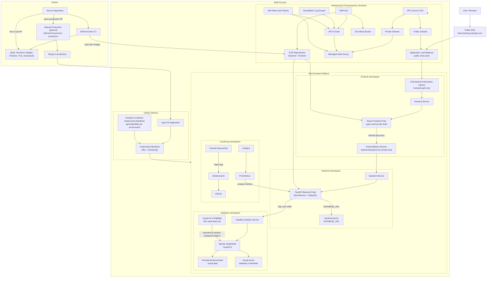
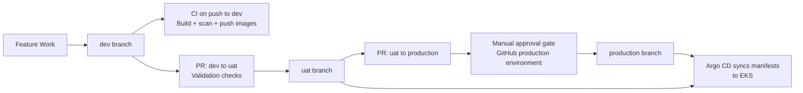
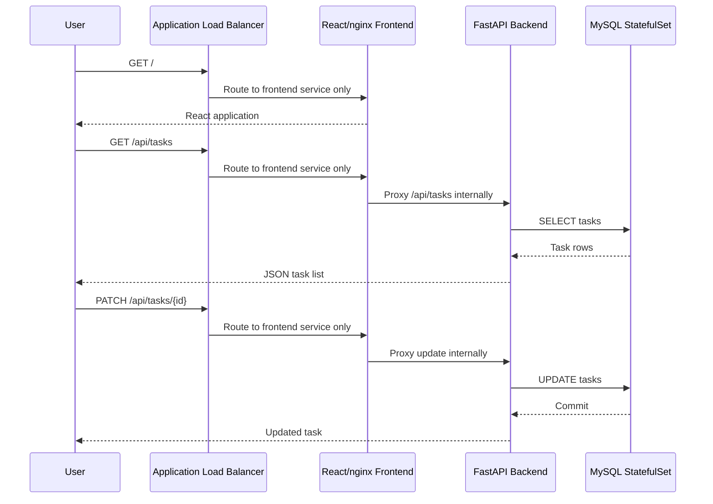

# Architecture

## End-to-End Architecture

## Promotion Flow

## Runtime Request Flow

## Runtime

The task tracking app uses a React frontend, FastAPI backend, and MySQL database. Frontend and backend containers are stateless and can scale horizontally. MySQL runs as a local container for development and as a Kubernetes StatefulSet in the included manifests.

The frontend is served by nginx and calls the backend through `/api` routes. In Kubernetes, public traffic enters through an AWS Application Load Balancer and routes only to the frontend service. The frontend nginx container proxies `/api` requests to the internal backend service through the frontend namespace `ExternalName` service. The backend reads `DATABASE_URL` from `backend-secret` and connects to MySQL through the headless `mysql` service in the database namespace.

Fresh MySQL databases are initialized with `database/init/001-seed-tasks.sql` locally and with the `mysql-init` ConfigMap in Kubernetes. The script creates the `tasks` table if needed and inserts sample tasks for `todo`, `in_progress`, and `done`.

## Platform

Terraform provisions an AWS EKS cluster with networking across three availability zones and a managed node group with two desired worker nodes.

The Terraform environments (`dev`, `uat`, and `production`) provision the shared platform pattern with environment-specific names, CIDR ranges, ECR repositories, KMS encryption, CloudWatch log groups, and worker node settings. Each environment also accepts `backend_image_url` and `frontend_image_url` through tfvars and renders deployment manifests from templates.

Terraform installs the AWS Load Balancer Controller into EKS with Helm and an IRSA-backed service account. The Kubernetes ingress uses `ingressClassName: alb`, allowing the controller to create and manage the public Application Load Balancer that forwards traffic only to the frontend service.

## Delivery

GitHub Actions validates application builds, Terraform, Dockerfiles, Kubernetes manifests, and source quality. Argo CD continuously syncs the Kubernetes manifests from the repository.

The branch promotion model is:

- Pushes to `dev` run validation and publish backend/frontend images to ECR.
- Pull requests from `dev` to `uat` run UAT validation.
- Pull requests from `uat` to `production` pause at the `production` GitHub Environment approval gate.

## Security

Checkov scans Terraform, Kubernetes, Dockerfiles, and GitHub Actions. Trivy scans the repository filesystem and built images. SonarQube analysis runs when `SONAR_TOKEN` and `SONAR_HOST_URL` repository secrets are configured.

Kubernetes secrets hold database connection values and MySQL credentials. EKS uses KMS-backed encryption for configured cluster resources, and ECR repositories use KMS encryption with image scanning enabled.

## Observability

Prometheus scrapes annotated pods, Grafana visualizes metrics, and Fluentd ships Kubernetes logs to Elasticsearch for Kibana search and dashboards.
